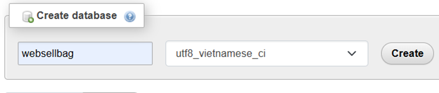
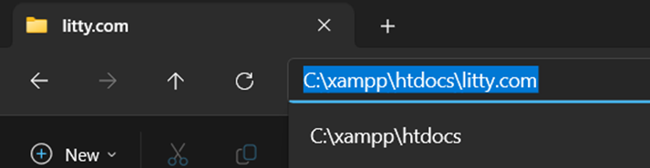
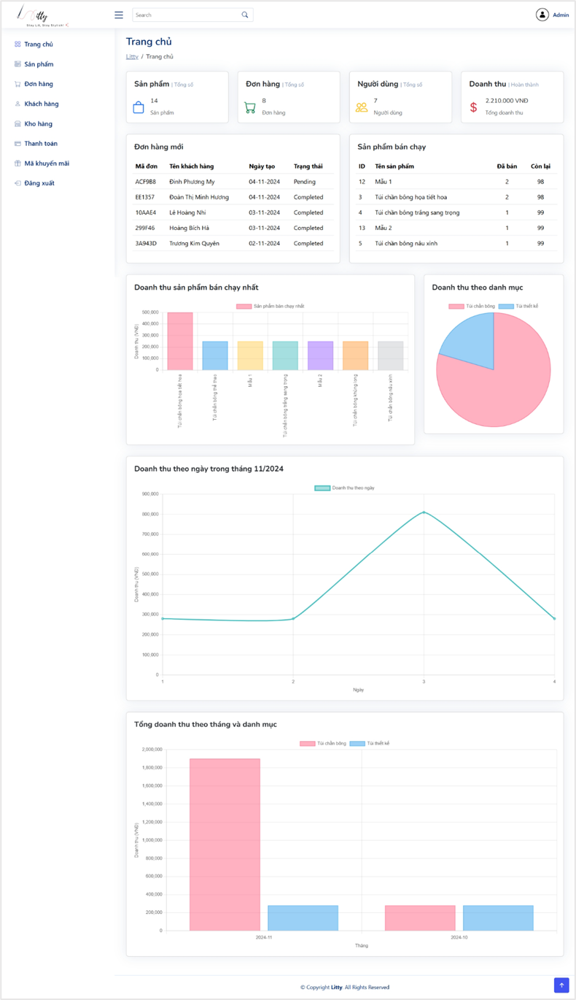
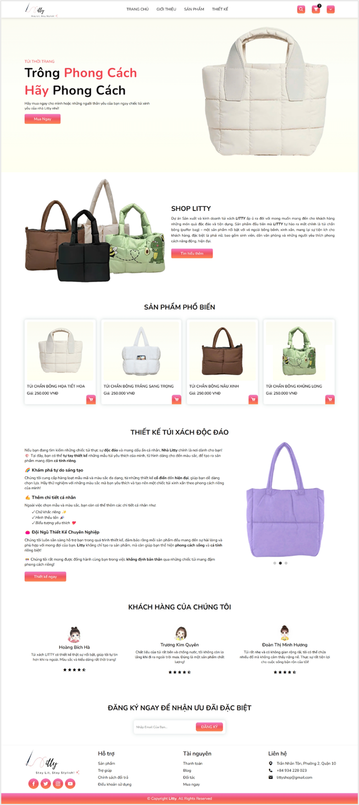

# Handbags Management System

**Litty - Stay Lit, Stay Stylish**

-----------------------------------------------------------------------------
**Cách chạy chương trình Litty**

***Bước 1. Cài đặt và khởi động XAMPP***
- Tải XAMPP từ link sau: https://sourceforge.net/projects/xampp/files/XAMPP%20Windows/8.2.12/xampp-windows-x64-8.2.12-0-VS16-installer.exe
- Làm theo các bước cài đặt trong hướng dẫn của XAMPP.
- Khởi động XAMPP và start Apache và MySQL.

***Bước 2. Truy cập phpMyAdmin và tạo Database***
- Sau khi MySQL đã được khởi động, bấm nút Admin kế bên nút Stop của MySQL. Nó sẽ mở trang phpMyAdmin trong trình duyệt của bạn.
- Trong trang phpMyAdmin, chọn Databases và tạo một database mới với tên *websellbag*.

- Sau khi tạo xong database, chọn SQL để mở giao diện nhập SQL.
- Vào folder database, mở file *data.sql* -> Copy, dán câu lệnh SQL và bấm *Go* để chạy SQL.

***Bước 3. Copy thư mục dự án vào thư mục htdocs của XAMPP***
- Sao chép toàn bộ thư mục litty.com vào thư mục **C:\xampp\htdocs**.
- Đảm bảo đường dẫn cuối cùng sẽ là: C:\xampp\htdocs\litty.com

***Bước 4. Truy cập vào ứng dụng web***

Mở trình duyệt và truy cập địa chỉ http://localhost/litty.com

- Tài khoản Admin (dùng để quản lý hệ thống):
    + Tên đăng nhập: litty@gmail.com
    + Mật khẩu: admin

-> Truy cập vào giao diện Admin để quản lý sản phẩm, đơn hàng và các chức năng khác.

- Tài khoản khách (dùng để mua hàn hoặc không cần đăng nhập vẫn mua được):
    + Tên đăng nhập: <email người dùng>
    + Mật khẩu: 123456789 (Đã tạo sẵn một số tài khoản mẫu).

-> Truy cập vào giao diện Khách để mua hàng và xem các sản phẩm.

